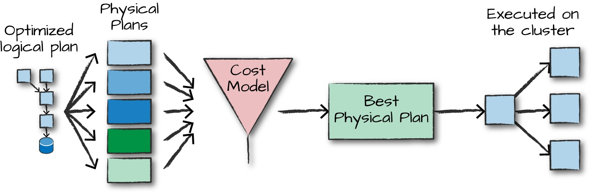

# Spark The Definitive Guide

## Spark Application 2 parts:

    1 Driver Process: run main() 
        maintain sparkSession
        interact with user application
        assign task to executor
    n Exeuctor Processes
        run code
        report to driver node
        -- it also communicate with `cluster`

Spark Session - the entry point for spark
Data Frame - table : ***NEED TO FIND DIFFERENCE DataFrame, Dataset, RDD***

Partition - data chunk that sit on same physical machine. 1 partition per
running thread.

Transofrmations:

1. Transformation are abstract, no action until    `action`. ***Lazy Evaluation*** read data is also a transformation

2. Narrow Transformation is 1 partition output 1 partition data, no data
cross partition, Narrow Dependency eg filter

3. Wide Trnasforamtion A.K.A **Shuffle**, data cross the partition to
generate result. eg aggregation

Default `shuffle` will use 200 partitions, you can use following code to
`downsize` the partition number:

~~~java
spark.conf.set("spark.sql.shuffle.partitions","5")
dataSet.sort("column").take(2)
~~~

use `sql` way to perform tranformation:

~~~scala
dataSet.createOrReplaceTempView("tmpTable")
val sqlDataSet = spark.sql("""select column, count(1) from tmpTable Group by
column""")

val groupByDataSet = dataSet.groupBy("column").count()

sqlDataSet.explain()
groupByDataSet.explain()
~~~

both show same execution plan.

some available transform function:

find the max value of a column("count")

~~~scala

//first read the file
val data = spark.read.option("inferSchema", "true").option("header", "true").csv("/home/rongshen/Downloads/Wealth-AccountsData.csv")

sqlDataSet = spark.sql("select max(count) from tmptable").take(1)
dataSet.select(max("count")).take(1)
~~~

select top5

~~~java
val maxSql = spark.sql("""
SELECT DEST_COUNTRY_NAME, sum(count) as destination_total
FROM flight_data_2015
GROUP BY DEST_COUNTRY_NAME
ORDER BY sum(count) DESC
LIMIT 5
""")
maxSql.show()

//spark way
import org.apache.spark.sql.functions.desc

flightData2015
.groupBy("DEST_COUNTRY_NAME")
.sum("count")
.withColumnRenamed("sum(count)", "destination_total")
.sort(desc("destination_total"))
.limit(5)
.show()
~~~

This picture showing the `DAG` (directed acyclic graph) of tranformation.

use `explain()` to see the transformation plan: the `explain()` result need to
read from bottom to top: that is the execution order.

Action:

3 types of actions:

Action to view data in console

Action collect data to native data object ??

Action write source data.

## Chapter 3: a tour of spark toolset

`Structured API`: Datasets, DataFrames and SQL
`Low level API`: RDDs

run spark with `spark-submit` example:

~~~scala
/usr/local/spark-2.4.7-bin-hadoop2.7 # must in this folder
spark-submit \
--master localhost  \
./examples/jars/spark-examples_2.11-2.4.7.jar 10
~~~

Dataset is `structured type` so not available in python and R

Specify number of Partition: This configuration specifies the
number of partitions that should be created after a shuffle. remember `Partition` and `executor` is 1-to-1 mapping, so if you don't have that much of `executor`, then you don't need that much of partition, in the book, the example say `take(5)`, so techinally it only need 5 partition and exeuctors.

~~~scala
spark.conf.set("spark.sql.shuffle.partitions", "5")
~~~

Streaming read:

~~~scala

val streamingDataFrame = spark.readStream
.schema(staticSchema)
.option("maxFilesPerTrigger", 1)
.format("csv")
.option("header", "true")
.load("/data/retail-data/by-day/*.csv")

streamingDataFrame.isStreaming // returns true
~~~

The `action` for streaming is different as `sql`, 2 ways: write stream to memory table or dump to console:

write to memory table:
~~~scala
purchaseByCustomerPerHour.writeStream
.format("memory") // memory = store in-memory table
.queryName("customer_purchases") // the name of the in-memory table
.outputMode("complete") // complete = all the counts should be in the table
.start()

//then read by sql
spark.sql("""
SELECT *
FROM customer_purchases
ORDER BY `sum(total_cost)` DESC
""")
.show(5)
~~~

dump to console:
~~~scala
purchaseByCustomerPerHour.writeStream
.format("console")
.queryName("customer_purchases_2")
.outputMode("complete")
.start()
~~~

when to use RDDs? `seq()` data from memory in `pallarize` way:

~~~scala
spark.sparkContext.parallelize(Seq(1, 2, 3)).toDF()
~~~

## Chapter 4: Structured API Overview

3 core structured APIs:

- Datasets
- DataFrames
- SQL tables and views

`Datasets` and `Dataframes` are immutable, `SQL table and views` basically same as `DataFrames`, different is we execute SQL on it.

Difference between `DataFrames` and `Datasets`: 

`DataFrames` is `untyped`
`Datasets` is `typed`

`Row` is used by `DataFrame`, it can created from:

- SQL
- RDDs
- Data source

Java Type mapping: page 62

spark execution plan

~~~
user submit code -> unresolved logical plan -> resolved logical plan -> optimized logical plan -> physical plan 
~~~

the `logical plan` to `physical plan` is the key:

it compare the different models before select one.

## Chapter 5: Basic Structured Operations : DataFrame

Core parts: 

`DataFrames` : table

`columns`: column in table **Important**

`Rows`: row **Important**

`Schema`: table schema define name and type 

`Partitioning`: physical distribution of `DataFrames`

`Partitioning Schmea`: define how `Partition` located.

read json file
~~~scala
val df = spark.read.format("json")
.load("/data/flight-data/json/2015-summary.json")
~~~

pring schme:
~~~
df.printSchema()
~~~

### Columns
`Columns` are `expression`: tranformation function.

to get column: (but don't know why)

~~~java
df.col("column_name") 
df.expr("column_name")
~~~

because it is expression, so you can use it to calculate:

~~~java
col("column_name") - 5
expr("column_name") - 5
~~~

get all Columns -- different as `printSchema()` since this get a list of columns

~~~java
spark.read.format("json").load("/data/flight-data/json/2015-summary.json").columns
~~~

### Rows

manually create `Row` object:

~~~java
import org.apache.spark.sql.Row
val myRow = Row("Hello", null, 1, false)
~~~

### Column and Row tranformation

1. Add rows and columns
2. remove rows and columns
3. transformat rows to column (pivot)

Create `DataFrame` manually:

~~~java
import org.apache.spark.sql.Row
import org.apache.spark.sql.types.{StructField, StructType, StringType, LongType}
//create schema
val myManualSchema = new StructType(Array(
new StructField("some", StringType, true),
new StructField("col", StringType, true),new StructField("names", LongType, false)))
//create row
val myRows = Seq(Row("Hello", null, 1L))
val myRDD = spark.sparkContext.parallelize(myRows)
//create DataFrame
val myDf = spark.createDataFrame(myRDD, myManualSchema)
myDf.show()
~~~

Only select 1 column
~~~java
// in Scala
df.select("DEST_COUNTRY_NAME").show(2)
~~~

~~~sql
-- in SQL
SELECT DEST_COUNTRY_NAME FROM dfTable LIMIT 2
~~~

Create new `DataFrame` with existing column and new column:

~~~scala
df.selectExpr(
"*", // include all original columns
"(DEST_COUNTRY_NAME = ORIGIN_COUNTRY_NAME) as withinCountry")
.show(2)

//aggregation table
df.selectExpr("avg(count)", "count(distinct(DEST_COUNTRY_NAME))").show(2)
~~~

~~~sql
-- in SQL
SELECT *, (DEST_COUNTRY_NAME = ORIGIN_COUNTRY_NAME) as withinCountry
FROM dfTable
LIMIT 2
~~~

#### Add new column 

- non formal

~~~scala
// in Scala
import org.apache.spark.sql.functions.lit
df.select(expr("*"), lit(1).as("One")).show(2)
//this will create new column "One" and value with 1

-- in SQL
SELECT *, 1 as One FROM dfTable LIMIT 2
~~~

- formal

~~~scala
// in Scala
df.withColumn("numberOne", lit(1)).show(2)

// in Scala
df.withColumn("withinCountry", expr("ORIGIN_COUNTRY_NAME == DEST_COUNTRY_NAME"))
//this add new column "withinCountry" the value is boolean depends on the "expr"
~~~

#### Rename Column
~~~scala
df.withColumnRenamed("DEST_COUNTRY_NAME", "dest").columns
~~~

#### Remove Column
~~~scala
df.drop("ORIGIN_COUNTRY_NAME").columns
~~~

#### Filtering Rows

~~~scala
df.filter(col("count") < 2).show(2)
df.where("count < 2").show(2)
~~~

you can `chain` where clause:
~~~scala
df.where(col("count") < 2).where(col("ORIGIN_COUNTRY_NAME") =!= "Croatia")
.show(2)
~~~

#### DISTINCT clause

~~~scala
// in Scala
df.select("ORIGIN_COUNTRY_NAME", "DEST_COUNTRY_NAME").distinct().count()
# in Python
df.select("ORIGIN_COUNTRY_NAME", "DEST_COUNTRY_NAME").distinct().count()
~~~
~~~sql
-- in SQL
SELECT COUNT(DISTINCT(ORIGIN_COUNTRY_NAME, DEST_COUNTRY_NAME)) FROM dfTable
~~~

#### Union

Following code shows:

1. cretae new `DataFrame` from current `DataFrame`
2. manually create `Row`
3. `union` 2 `DataFrame`

~~~scala
// in Scala
import org.apache.spark.sql.Row

//copy schem
val schema = df.schema

//manually create row
val newRows = Seq(
Row("New Country", "Other Country", 5L),
Row("New Country 2", "Other Country 3", 1L)
)
val parallelizedRows = spark.sparkContext.parallelize(newRows)
//create new DataFrame
val newDF = spark.createDataFrame(parallelizedRows, schema)

//union
df.union(newDF)
.where("count = 1")
.where($"ORIGIN_COUNTRY_NAME" =!= "United States")
.show() // get all of them and we'll see our new rows at the end
~~~

#### Sorting

sort with `desc` or `asc`

~~~scala
// in Scala
import org.apache.spark.sql.functions.{desc, asc}

df.orderBy(expr("count desc")).show(2)
df.orderBy(desc("count"), asc("DEST_COUNTRY_NAME")).show(2)
~~~

~~~sql
-- in SQL
SELECT * FROM dfTable ORDER BY count DESC, DEST_COUNTRY_NAME ASC LIMIT 2
~~~

other sorting strategy:

asc_nulls_first, desc_nulls_first, asc_nulls_last, desc_nulls_last

#### `Repartition`  VS `Coalesce` ***IMPORTANT***

- `Repartition` ONLY when future partition will  **MORE** than current partitions

- `Repartition` will cause `shuffle` 

~~~scala
// repartition
df.rdd.getNumPartitions // 1
df.repartition(5)

// repartition with column
df.repartition(5, col("DEST_COUNTRY_NAME"))
~~~

- `Coalesce` combine partition
- `Coalesce` will **NOT** incur full `shuffle`

***Combine with `Repartition` and `Coalesce` to improve the performance***

following is

- repartition to 5 partitions (shuffle)

- then combine partition to 2 (no shuffle)

~~~scala
df.repartition(5, col("DEST_COUNTRY_NAME")).coalesce(2)
~~~

### Chapter 6: Working with Different Types of Data

- most of the where clause could be used in SQL
- you can use regular expression
- deal `null` value in sql

~~~SQL
-- in SQL
SELECT
ifnull(null, 'return_value'),
nullif('value', 'value'),
nvl(null, 'return_value'),
nvl2('not_null', 'return_value', "else_value")
FROM dfTable LIMIT 1
~~~

complex data type: page 117

### Chapter 7 : Aggregation

Keyword?

- `groupBy` - yes
- `window` ?
- `grouping set` - bunch of `groupBy`
- `rollup` ? - column `groupBy`
- `cube` ?

skip `rollup`, `cube` and `window` -> not necessary currently

### Chapter 8 Joins

~~~scala
val person = Seq(
(0, "Bill Chambers", 0, Seq(100)),
(1, "Matei Zaharia", 1, Seq(500, 250, 100)),
(2, "Michael Armbrust", 1, Seq(250, 100)))
.toDF("id", "name", "graduate_program", "spark_status")
~~~

then use following command to copy-paste multiple line in `spark-shell`

~~~scala
scala> :paste
// Entering paste mode (ctrl-D to finish)

val person = Seq(
(0, "Bill Chambers", 0, Seq(100)),
(1, "Matei Zaharia", 1, Seq(500, 250, 100)),
(2, "Michael Armbrust", 1, Seq(250, 100)))
.toDF("id", "name", "graduate_program", "spark_status")

// Exiting paste mode, now interpreting.

person: org.apache.spark.sql.DataFrame = [id: int, name: string ... 2 more fields]

~~~

join need 2 step:

1. create join Expression:
    ~~~scala
    val joinExpression = person.col("graduate_program") === graduateProgram.col("id")
    ~~~

2. use join expression on df:
    ~~~scala
    person.join(graduateProgram, joinExpression).show()
    ~~~

you can define the join type on join expression:

~~~scala
joinType = "outer" // could be "left_outer", "right_out"
person.join(graduateProgram, joinExpression, joinType).show()
~~~

Two join Strategy that Spark use:

- node-to-node communication strategy 
- per node computation strategy

based on the `big-table to big-table` or `big-table to small-table`

### Chapter 9: Data Source

#### Read Data

Basic format
~~~scala
DataFrameReader.format(...).option("key", "value").schema(...).load()
~~~
The `DataFrameReader` is from `spark.read` so above format can change to:

~~~scala
spark.read.format(...).option("key", "value").schema(...).load()
~~~

Basic Builder function:

- format
- schema
- read mode
- A series of options

each of these functions return `DataFrameReader`, and then finally call `load()` to read data.

#### Write Data

basic format:

~~~scala
DataFrameWriter.format(...).option(...).partitionBy(...).bucketBy(...).sortBy(
...).save()
~~~

`DataFrame.write()` provide the `DataFrameWriter` object above
function are same as read

#### CSV file

all options see page 164

#### JSON file

Spark prefer `line-delimniter` JSON format option see page 167

#### Parquet Format : column oriented file format

***Spark prefer read/write in parquest file format***

### SQL Database

load JDBC connection jar in `spark-shell`

~~~bash
./bin/spark-shell \
--driver-class-path postgresql-9.4.1207.jar \
--jars postgresql-9.4.1207.jar
~~~

JDBC options page 176

connect to database

~~~scala
val driver = "org.sqlite.JDBC"
val path = "/data/flight-data/jdbc/my-sqlite.db"
val url = s"jdbc:sqlite:/${path}"
val tablename = "flight_info"
~~~

test connections

~~~scala
import java.sql.DriverManager
val connection = DriverManager.getConnection(url)
connection.isClosed()
connection.close()
~~~

read data

~~~scala
val dbDataFrame = spark.read.format("jdbc").option("url", url)
.option("dbtable", tablename).option("driver", driver).load()

val pgDF = spark.read
.format("jdbc")
.option("driver", "org.postgresql.Driver")
.option("url", "jdbc:postgresql://database_server")
.option("dbtable", "schema.tablename")
.option("user", "username").option("password","my-secret-password").load()
~~~

***Query Pushdown***

This is spark performance tunning on sql, it will not fetch all the data 

~~~scala
//only pick 1 column
dbDataFrame.select("DEST_COUNTRY_NAME").distinct().explain

//pushedFilters
dbDataFrame.filter("DEST_COUNTRY_NAME in ('Anguilla', 'Sweden')").explain
~~~

you can use `explain` to see the query.

All above is you tell spark to tunning the SQL, but you can use `Query Pushdownn` to do it:

***Instead of pass table, pass the Query*** => Query Pushdown

~~~scala
val pushdownQuery = """(SELECT DISTINCT(DEST_COUNTRY_NAME) FROM flight_info)
AS flight_info"""
val dbDataFrame = spark.read.format("jdbc")
.option("url", url).option("dbtable", pushdownQuery).option("driver", driver)
.load()
dbDataFrame.explain()
~~~

*** Prevent Overhaul JDBC Connections***

use `numPartitions` to prevent that:

~~~scala
val dbDataFrame = spark.read.format("jdbc")
.option("url", url).option("dbtable", tablename).option("driver", driver)
.option("numPartitions", 10).load()
~~~

*** user `Predicates` to specify data read from each physical partition*** 

~~~scala
// in Scala
val props = new java.util.Properties
props.setProperty("driver", "org.sqlite.JDBC")
val predicates = Array(
"DEST_COUNTRY_NAME = 'Sweden' OR ORIGIN_COUNTRY_NAME = 'Sweden'",
"DEST_COUNTRY_NAME = 'Anguilla' OR ORIGIN_COUNTRY_NAME = 'Anguilla'")
spark.read.jdbc(url, tablename, predicates, props).show()
spark.read.jdbc(url, tablename, predicates, props).rdd.getNumPartitions // 2
~~~

that will be 2 partition each read 1 country.

*** Becareful the `Predicates` MUST be `Disjoint` data, otherwise will be duplicates in different partitions***

Partition based on a sliding window --- not quite understand page 179

Read Data in Paralle: multiple executors can ***NOT*** read same file, you need to split and then
exeuctor can read parallized.

Write Data in Paralize: per partition per file

Partitioning: write file in column fashion (parquet)
Bucketing: Avoid the shuffle when you read data later.

control the file size : ***DO NOT write small file*** cause many unnecessary mete-data file

use this to control file size:

~~~scala
//5000 records per file
df.write.option("maxRecordsPerFile", 5000)
~~~

2/26/2021 

