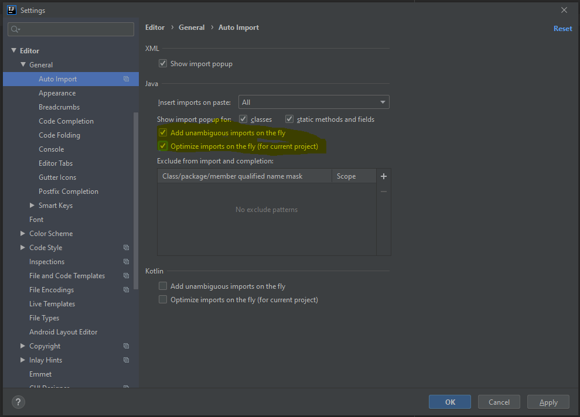
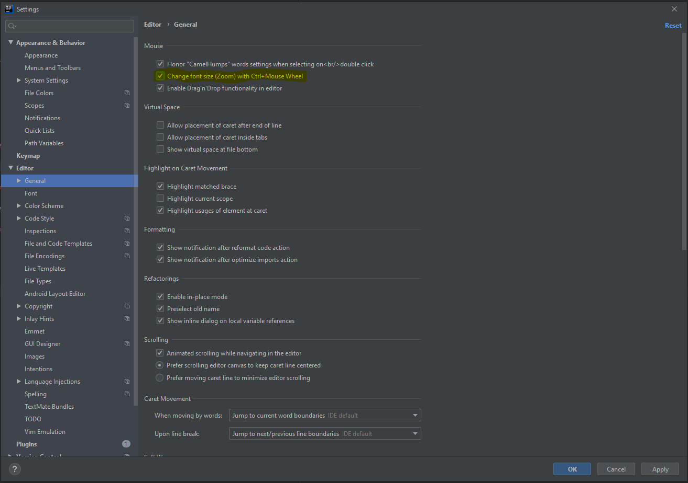
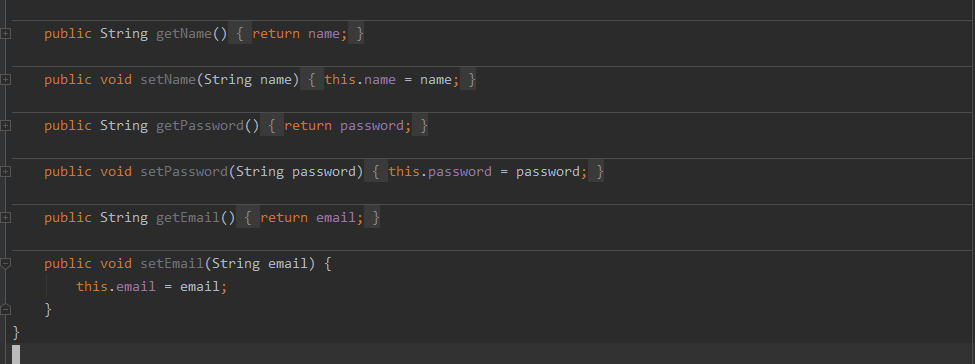
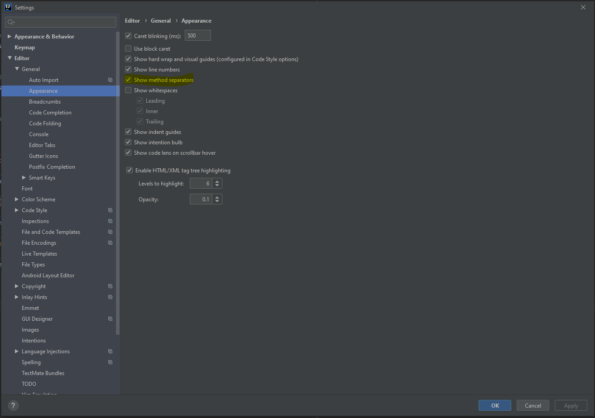
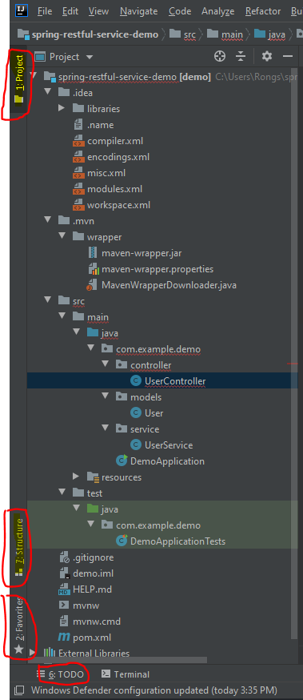
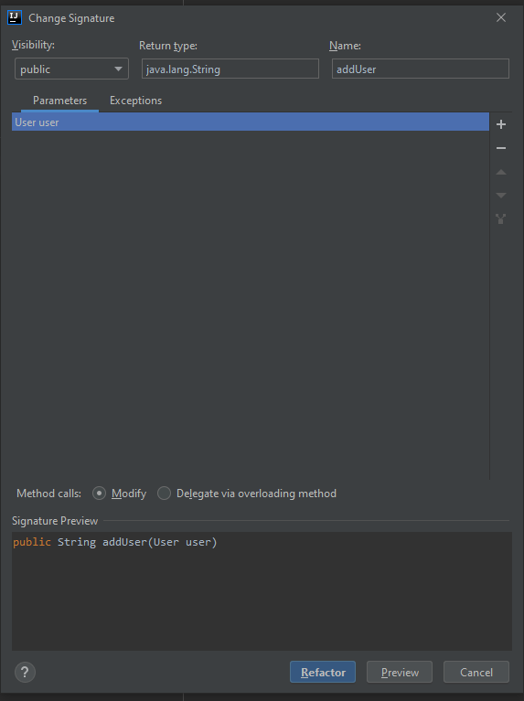
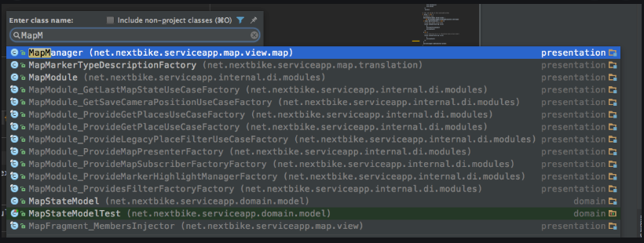
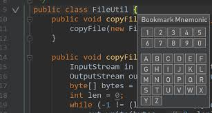

## No more "Alt + Enter" : Modify the "Auto Import" option

This will optimize you imports without use `Ctrl + Alt + o`

* Shortcut for "Split Vertical" and "Split Horizontally"

I usually define "Split and move right" instead of "Split Vertical", this "move" current window to Vertical right intead of "copy".

I use `Ctrl + "` beccause "quote" looks like 2 windows (dots) arrange vertical.

I usually define 'Split and move bottom" instead of "Split Horizontally", same reason.

I use `Ctrl + ;` because ";" looks like 2 windows (dots) arrange horizontally.

## Enable the "zoom" function

in browser you can use `Ctrl + +/-` zoom in and zoom out, in Intellij, you can enable zoom function too (see below) picture, but it use `Ctrl + mouse wheel`, personally I think this is better than `Ctrl + +/-`.

## Show method seperator

Following picture show the code with method seperator enabled: 

if you like, you can enable it in Settings:

## Jump between windows with `Alt + number`

There are window in Intellij with number:

you can use `Alt + number` to open thoese windows, eg. if you want to open "Favorites" window, press `Alt + 2`, it will open the favorites window immediately.

When you don't want to see `Project` window, you can use `Shift + Esc` to minimize, if you want to jump from `Project` window back to edit window (withou minimize `Project` window), just `Esc`.

## Forgot shortcut? No problem! `Ctrl + Shift + A`

`Ctrl + Shift + A` is for "find Action", once you click it will pop dialog let you type in the action you want, and it will list the action with the shortcut.

## Refact with `Shift + F6` and `Ctrl + F6`

On an variable, `Shift + F6` and then change variable name, Intellij will change all the occurance of this variable.

On an method, `Ctrl + F6` will open dialog to let you change the signature of this method.

* You also can use `Alt + Enter` in the implement of this method to modify the signature of the method.

## Extract Variable/Constant

let cursor on the "some String" and then:

`Ctrl + Alt + v` - extract the "some String" or variable into local variable

`Ctrl + Alt + c` - extract the "some String" or variable into local constant

`Ctrl + Alt + f` - extract the "some String" or variable into class member variable (name = "some String")

`Ctrl + Alt + p` - extract the "some String" or variable into this method input parameter (name = "some String")

`Ctrl + Alt + m` - extract the "some String" or variable or lines of code into method

## Show local history

Different as GIT, show local history will bring you the changes that stored in Intellij local

`Alt + Shift + A` then type "Show History"

## jump between previous <-> next in the code

`Ctrl + Alt + right Arrow" : jump to next point

`Ctrl + Alt + Left Arrow" : jump back to previous point

## jump between java files by `Ctrl + n`

This help you to jump(search) to a java file by type a few word of that java class name, this is better than you search that java class file in the project window.

if you want to jump(search) to a non-java file, you can use `Ctrl + Shift + N`

you also can use `Ctrl + Alt + Shift + N` to search function name and then jump to that function

## Jump between methods in same file 

`Ctrl + F12` will popup a small dialog box list all the methods of current file, then you can choose to jump

## Use `book mark` to save code snippet

if you save some code in the project as code snippet, you can use `Book Mark` function to save and later you can find them in `Favorites` window:

`F11` will save current line into book mark

`Ctrl + F11` allow you to save book mark with either 1 number or 1 letter (uppercase)

## Add current java file/Method to my favorite!

You can save your java file into favorite -- just like same as Chrome browser.

`Alt + Shift + F` will pop a window to let you choose which favorite list to add current java file, once you added, you can see them later in that list after you open the favoriate window (`Alt + 2`)

## Batch process

`Ctrl + Alt + Shift + J` called "Select All Occurences" will provide you a batch edit on all those same word together.

## Use `Alt + Enter` == auto complete
