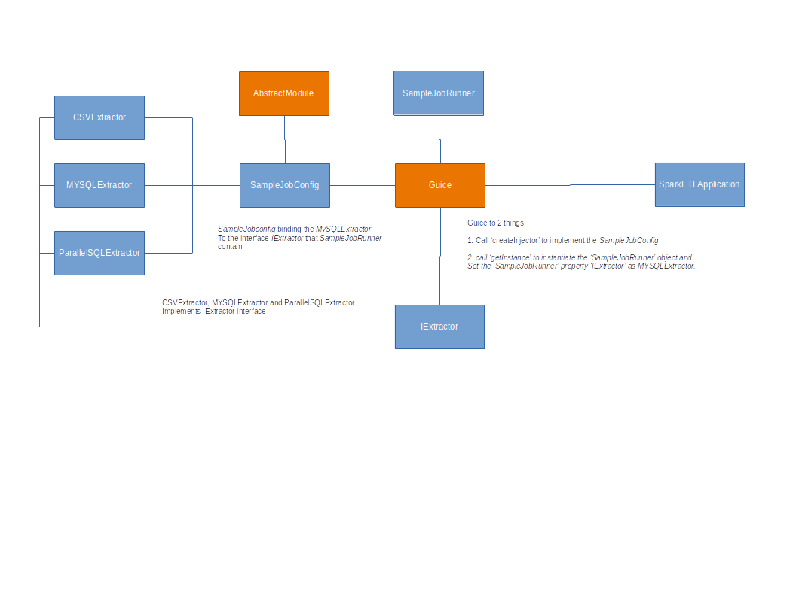

Google Guice is light way DI framework, I recently worked on Spark, so can't use spring framework, so I use Google Guice to replicate the spring DI, I will show both Spring config and Google Guice to compare both.

Following is the picture to display what I want to do:

So we design ETL tool, and ETL tool need `Extractor` to extrate data from either CSV file or database, and when we assemble our job, we need binding one of the extractor to the `SampleJobRunner` and then give to `SparkETLApplication` the main class to run.

Here is how Spring frame work will do:

~~~java
@Configuration
@PropertySource("classpath:samplejob.yml")
@ConfigurationProperties
@Getter
@Setter
public class SampelJobConfig{

    @Bean(name="MySQLExtractor")
    public Extractor<SampleJobEvent> MySQLExtractor(){
        Extractor<SampleJobEvent> dbDataExtractor = new DBDataExtractor();
        return dbDataExtractor;
    }

    @Bean(name="SampleJobRunner")
    public JobRunner SampleJobRunner(JobConfig jobConfig, Loader<SampleJobEvent> sampleLoader, Extractor<SampleJobEvent> MySQLExtractor){
        JobRunner jobRunner = new JobRunner(jobConfig);
        Transformer<SampleJobEvent> transformer = new SampleTranformer();
        jobRunner.setLoader(sampleLoader);
        jobRunner.setExtractor(MySQLExtractor);
        jobRunner.setTransformer(transformer);

        return jobRunner;
    }
}
~~~

Here is how to do in Guice:

SampleJobConfig

~~~Java
public class SampelJobConfig extends AbstractModule{
      @Override
      protected void configure() {
            bind(Extractor.class).to(DBDataExtractor.class);
      }
}
~~~

SimpleSparkEtlJobApplication:

~~~java
@Slf4j
public final class SimpleSparkEtlJobApplication {
    private SimpleSparkEtlJobApplication() {
        //disable construct
    }

    public static void main(String[] args) {
        //call jobRunner.run to start the process
        Injector injector = Guice.createInjector(new SampleJobConfig());
        JobRunner jobRunner = injector.getInstance(JobRunner.class);
        jobRunner.run();
    }
~~~
